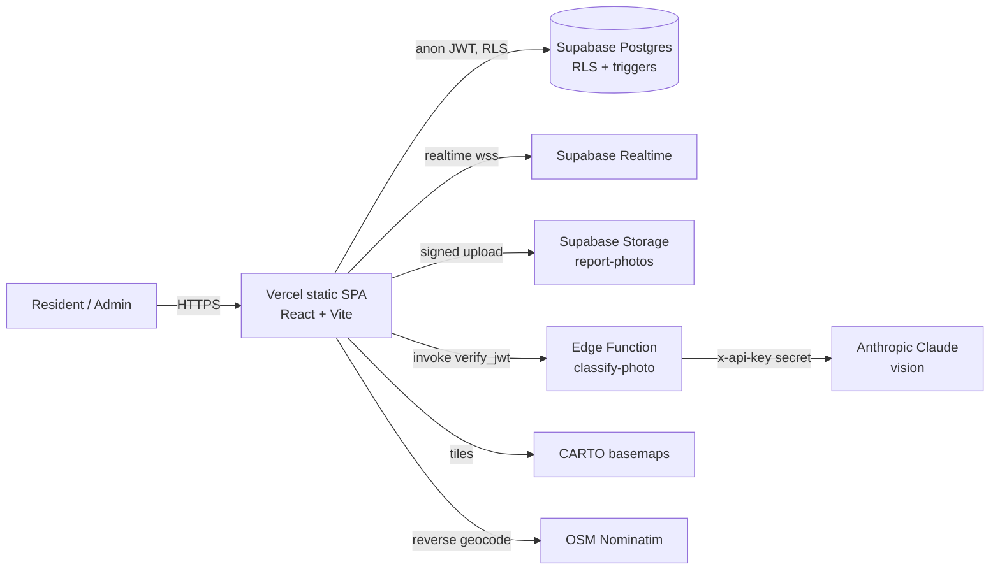

# CivicSnap — Production Hardening

Status of the production-readiness program. Legend: **✅ Done** · **🟡 Partial** ·
**☁️ Platform-provided** · **📝 Planned (next pass)**.

| Area | Status | Where / How |
| --- | --- | --- |
| Idempotency (mutating API) | ✅ | `reports.idempotency_key` + unique `(reporter_id, idempotency_key)` (`0004_idempotency.sql`); client upsert in `src/lib/api.ts` `createReport`; key reused across retries in `ReportPage`. Upvotes idempotent (PK + duplicate-ignore). |
| Retry with backoff | ✅ | `src/lib/retry.ts` (exponential backoff + jitter, transient-only). Wraps the idempotent create and the AI classify call. |
| Input sanitization / injection prevention | ✅ | All DB access via parameterized PostgREST/`supabase-js` (no string SQL). DB `CHECK` constraints + length limits. Edge function validates/sanitizes AI tool output against an allow-list. |
| Authentication | ✅ | Supabase Auth (email/password), JWT sessions. |
| Authorization / roles / permissions | ✅ | `profiles.role` (`resident`/`admin`); RLS everywhere; `is_admin()` `SECURITY DEFINER`; status changes admin-only (enforced in trigger + RLS). |
| Session management / token expiry | ☁️✅ | Supabase short-lived access token + refresh; client auto-refresh, sign-out revokes. |
| Secrets management | ☁️✅ | `ANTHROPIC_API_KEY` only in the edge-function secret store; only public anon key in the client (`.env.production`), protected by RLS. |
| HTTPS / TLS / encryption | ☁️ | TLS enforced by Vercel + Supabase; encryption at rest by Supabase (AES-256). `upgrade-insecure-requests` + HSTS set. |
| Rate limiting / abuse prevention | 🟡 | Per-user token-bucket in the `classify-photo` edge function. **Next:** durable (DB/Redis) limiter for write endpoints. |
| Dependency scanning / patching | ✅ | CI `security` job runs `npm audit --audit-level=high` (blocks on high/critical). Currently 0 vulnerabilities. |
| Multi-tenancy / data isolation | ✅ | RLS on every table; owner/admin scoping; storage policies scope uploads to `/<uid>/`. |
| PII handling | 🟡 | Minimal PII (email, display name, photo, coarse geo). Photos re-encoded client-side to strip EXIF/GPS. See **Data Policy** below. |
| Data retention / deletion | ✅ | Self-serve **Delete report** (owner/admin) on the detail page; `purge_expired()` (`0005_retention.sql`) removes rejected reports >90d (pg_cron one-liner in the migration); cascade deletes on user removal. |
| Regulatory compliance | 🟡 | GDPR-style posture documented (lawful basis, data-subject rights, minimization). Not formally certified. |
| Audit trails / tamper-evident logging | ✅ | `status_events` is an append-only audit log (no UPDATE/DELETE RLS policies) written by `SECURITY DEFINER` triggers; every status change recorded with actor + timestamp. |
| Security headers | ✅ | CSP, HSTS, X-Frame-Options, X-Content-Type-Options, Referrer-Policy, Permissions-Policy, COOP in `vercel.json`. |
| Unit tests | ✅ | Vitest (`src/lib/__tests__`): retry/backoff + domain invariants. |
| Integration tests | ✅ | `src/lib/__tests__/integration.test.ts` hits the live REST API: asserts anon can read reports but **cannot** insert (RLS). Self-skips without env. |
| End-to-end tests | ✅ | Playwright (`e2e/smoke.spec.ts`): landing, map, 404; runs against the prod build in CI. |
| Regression tests | ✅ | Unit + integration + e2e + typecheck + build gate every PR; grows with each bug fix. |
| Load / stress testing | ✅ | `load/k6-read.js` (ramped, p95<500ms / <1% error thresholds). |
| Chaos / resilience testing | ✅ | `circuit-breaker.test.ts` injects failures to verify open → fail-fast → half-open recovery. |
| CI / discovery / enforcement | ✅ | `.github/workflows/ci.yml`: lint, typecheck, build, tests, dependency audit on every push/PR. |
| Code review process / standards | ✅ | ESLint + strict TS + Vitest gate; conventional, reviewable commits; this doc as the bar. |
| Error handling / graceful degradation | ✅ | AI failure → manual entry; geolocation denied → manual pin + Dubai fallback; missing env surfaced; per-call try/catch with user-facing messages. |
| Circuit breakers / fallback | ✅ | `src/lib/circuit-breaker.ts` wraps the AI call (opens after 4 fails, 20s cooldown, half-open trial) → fails fast to manual entry. Plus geo/tiles fallbacks. |
| Concurrency / race prevention | ✅ | Idempotent upsert; DB-side `upvote_count` via trigger (atomic); unique constraints; backoff retries serialization failures (`40001`). |
| Caching strategy / invalidation | 🟡 | Immutable hashed assets + CDN; map tiles cached by browser. **Next:** SWR/react-query for report reads with realtime invalidation. |
| RTO / RPO + Disaster recovery | 🟡 | Targets + DR runbook below (RPO ≤ 24h via Supabase PITR/backups; RTO ≤ 1h redeploy). |
| Accessibility (WCAG) | 🟡 | Skip-to-content link, `<main>` landmark, semantic HTML, focus-visible rings, reduced-motion honored, alt text, labelled inputs, `aria-label`s on icon-only controls + unlabeled selects, `aria-pressed` on the upvote toggle. **Next:** live axe run + flatten any nested-interactive `<a><button>` pairs. |
| ADRs | ✅ | `docs/adr/0001..0003-*.md`. |
| Architecture diagram | ✅ | Mermaid below. |
| API contract | ✅ | `docs/openapi.yaml` (edge fn) + the data-access contract below. |

---

## Architecture

- **Trust boundary:** the browser only ever holds the public anon key; every read/write
  is mediated by Row Level Security. The Anthropic key lives solely in the edge function.
- **Mutations are idempotent** so client retries and double-submits cannot duplicate data.

## Data policy (PII / retention / compliance posture)

- **Data collected:** account email + display name, report text, a photo (EXIF/GPS
  stripped client-side via canvas re-encode), and a user-chosen map coordinate.
- **Lawful basis / minimization:** only what a civic report needs; no trackers, no ad SDKs.
- **Retention:** reports persist as a public record; account deletion cascades to the
  user's profile and nullifies authorship on their content. *Planned:* self-serve
  delete + scheduled purge of soft-deleted rows.
- **Data-subject rights:** export and delete are supported at the DB level today and are
  on the roadmap as self-serve UI.

## Disaster recovery (RTO / RPO)

- **RPO ≤ 24h** via Supabase automated daily backups (PITR on paid tiers tightens this to minutes).
- **RTO ≤ 1h:** frontend is stateless and redeployable from Git in minutes; database
  restores from the latest backup/branch. Migrations are versioned in `supabase/migrations`.
- **Runbook:** (1) restore Supabase project/branch from backup, (2) re-point env if the
  project ref changed, (3) `vercel deploy --prod`, (4) smoke test auth + map + report.

## API contract (summary)

| Operation | Auth | Idempotent | Notes |
| --- | --- | --- | --- |
| `POST functions/v1/classify-photo` | JWT (verify_jwt) | n/a (read) | base64 image → `{category,severity,title,description,confidence,is_valid_issue}`; rate-limited; retried client-side. |
| `reports` upsert | JWT, RLS insert | ✅ key | create/return report; `(reporter_id, idempotency_key)` unique. |
| `reports` update (status) | JWT, admin only | ✅ | trigger blocks non-admin status/category/severity/location changes; logs `status_events`. |
| `upvotes` insert/delete | JWT, RLS | ✅ | one per `(report,user)`. |
| `comments` insert | JWT, RLS | — | author scoped to `auth.uid()`. |

## ADRs (summary — to be split into docs/adr/)

1. **Supabase + RLS over a custom backend** — push authz into the database; no bespoke API tier to secure.
2. **Supabase Auth over Clerk (vs QueueUp)** — fully self-serviceable, fewer moving parts.
3. **Server-side AI in an edge function** — keep the Anthropic key off the client; constrain output via tool-use + allow-list.
4. **Idempotency via per-reporter key + upsert** — simplest correct dedupe; enables safe retries/backoff.
5. **Leaflet + CARTO/OSM over Mapbox** — no API key, no per-load billing.
